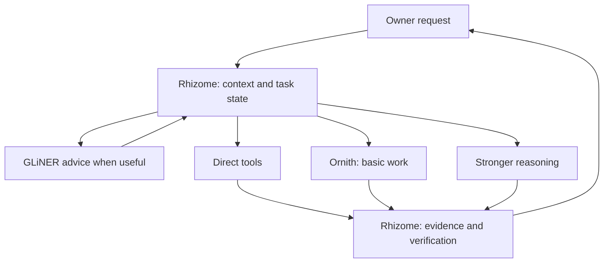

# GLiNER advice and the Ornith workforce

Rhizome owns the task. GLiNER suggests how to route it. Ornith supplies cheap,
bounded text work. Hard reasoning goes to a suitable stronger model already
configured in Rhizome. These are different responsibilities, not a compulsory
chain of model calls.

| Layer | Responsibility | Authority |
| --- | --- | --- |
| Owner (Pingu in the original stack) | Goals, corrections and priorities | Defines scope and permissions |
| Rhizome | Memory/RAG, blackboard, task state, context, tools, dispatch and verification | Supervises the job |
| GLiNER2.5-Decide | Optional classification and capability hints | Advisory only |
| Ornith | Extraction, formatting, summaries, repetitive comparison and first-pass research | Text-only worker |
| Stronger configured models | Difficult reasoning, substantial coding and consequential judgement | Work under Rhizome's control |



## What is implemented

`rhizome-stack workforce route` accepts a JSON request on stdin and returns
structured advice. `rhizome-stack workforce run` accepts a bounded job and calls
a configured local model with no tools. The bundled Ornith skill explains how
Rhizome uses these helpers. Both are shipped in the normal component deployment.

The Open WebUI → adapter → OpenClaw path is unchanged. Automatic browser routing,
a persistent classifier service, a durable worker queue and automatic return-path
classification are **not implemented**. This is an explicit, agent-operated
integration, not an installed autonomous switchboard. No live installation is
changed by publishing this repository update.

## Configure the local worker

After deploying the updated stack components, copy the example configuration to
a private location. Existing `stack.env` files are preserved by the installer;
add the configuration path locally if it is missing.

```bash
mkdir -p ~/.config/rhizome-stack
cp -n ~/.local/share/rhizome-stack/config/workforce.example.json ~/.config/rhizome-stack/workforce.json
chmod 600 ~/.config/rhizome-stack/workforce.json
```

Set `RHIZOME_WORKFORCE_CONFIG` in your local `stack.env` to the absolute path of
that file. Edit the JSON:

- Set `ornith_model` to the **exact** model identifier listed by your local server.
  There is no hard-coded Ornith version and no silent fallback.
- For Ollama, use `ornith_provider: "ollama"` and an endpoint such as
  `http://127.0.0.1:11434`.
- For a local OpenAI-compatible server, use `ornith_provider: "openai-compatible"`
  and its API base, for example `http://127.0.0.1:8081/v1`.
- Only HTTP loopback IP addresses are accepted. Hostnames, credentials, redirects
  and inherited HTTP proxies are rejected or disabled. Use a dedicated inference
  server, not the Rhizome adapter itself, to avoid recursive agent calls.
- Set context/output budgets from the model and server limits you actually
  verified. Catalogue membership alone does not establish context or capability.

Installing or selecting an LLM remains a separate owner operation. No weights,
credentials or runtime data are distributed here. The worker works without GLiNER.

Install the skills deliberately:

```bash
rhizome-stack skills install ornith-research-workforce openclaw-downstream-maintainer --dry-run
rhizome-stack skills install ornith-research-workforce openclaw-downstream-maintainer
```

Existing differing copies are preserved. For existing installations, compare the
new runtime guidance with local workspace notes rather than replacing them.

Send a small synthetic canary using stdin (never interpolate untrusted text into
shell code):

```bash
rhizome-stack workforce run <<'JSON'
{"job_id":"canary-1","attempt_id":"canary-1-a1","task":"Summarise in one sentence.","acceptance":"Preserve the supplied fact without adding claims.","input":"The adapter preserves the chosen model during retries."}
JSON
```

The returned model must match the configured ID. A normal answer is
`AWAITING_VERIFICATION`; a length limit is `INCOMPLETE`. Rhizome must inspect the
answer before accepting it. Tool calls are rejected and never executed. The
client uses one lock, no automatic retries and a wall-time bound. It cannot cancel
server-side inference reliably: after a timeout, reconcile server state before
starting another job. Job/attempt IDs correlate receipts; they are not a durable
queue or deduplication database. No prompt or output logs are created by this helper.

## Add GLiNER separately

Preview the optional dependency profile first. On an existing installation,
follow [maintenance guidance](MAINTENANCE.md) before running the full installer:

```bash
./install-linux.sh --dry-run --with-routing
```

`--with-routing` installs CPU PyTorch and a pinned GLiNER2 source revision into
`venvs/routing` when runtime installation is enabled. It does not download model
weights, activate routing or start a service. `--skip-runtime` also skips this
optional environment. Dependencies can be large; CPU inference avoids taking
VRAM from Ornith, but actual latency and RAM use still need measurement.

Stage a complete local snapshot of
[fastino/GLiNER2.5-Decide](https://huggingface.co/fastino/GLiNER2.5-Decide), including
its required encoder/tokenizer assets. Configure `gliner_model_path` to that
local directory and `gliner_python` to the absolute `venvs/routing/bin/python`
path. All classifier calls force offline loading; missing assets cause abstention,
not an unexpected download. The library API was reviewed at
`55656fbfa01d3d4a77485e1a1eeeaf682990ccdf`; full dependency installation and
checkpoint-backed inference still require target-machine acceptance.

Start with `mode: "shadow"`:

```bash
rhizome-stack workforce route <<'JSON'
{"request":"Summarise the supplied release note in one sentence."}
JSON
```

Compare `suggested_route` with Rhizome's own decision. `route` always remains
`rhizome`. Shadow mode must not influence dispatch. `advisory` allows the
supervisor to consider the proposal; it still does not dispatch automatically.
`off` skips the classifier entirely. Missing/invalid scores, low scores, errors
and overlong input return an abstention. The `0.8` score threshold is a provisional
configuration value, not calibrated accuracy. No entity-extraction or vision
capability is claimed for the classifier integration.

Inputs are bounded and passed without a truncation limit (`max_len=None`).
Do not silently summarise away a second task or a negation to meet the bound.
Long requests remain with Rhizome. Each call loads the classifier in a bounded
child process: this favours isolation over warm-start latency. Measure before
considering a persistent service.

## Acceptance and rollback

Run repository checks:

```bash
python3 tests/test_static.py
python3 tests/test_behaviour.py
python3 tests/test_workforce.py
```

Mocked classifier and local HTTP fixtures verify routing abstention, identity
checks, tool rejection, incomplete output, timeouts, packaging and preservation.
They do **not** establish model quality or real inference. On the target, compare
representative simple/hard/multi-part requests, profanity, damaged transcription,
ambiguous negation, unavailable models and conflicting state. Use separate tuning
and evaluation examples, and record latency and resource use. A failed canary stays
failed; do not turn an available catalogue into an inference success claim.

Disable GLiNER with `mode: "off"`. Stop calling the worker to disable delegation;
there is no workforce service to stop. Existing browser routing remains available.
The downstream-maintainer skill governs selective OpenClaw backports: adding this
workforce is not permission to upgrade the pinned gateway wholesale.
